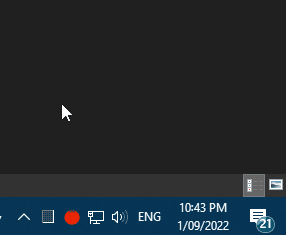

Pomodorino
---

Very simplistic pomodoro tray app made using Rust and Tauri

I recommend to check the technique in more details on the [official website](https://cirillocompany.de/pages/pomodoro-technique)

Currently the release has versions for Windows, Linux and Intel Macs.

It will work on Silicon macs as well but you'll need to build it yourself for now.

#### Credits:
- Tomato Icon: [Designed by Freepik](http://www.freepik.com/free-vector/delicious-ingredients-for-pizza_921351.htm)
- Audio: [From FreeSound.org](https://www.freesound.org/s/167337/)

#### Disclaimer:
Pomodoro Technique® and Pomodoro™ are registered and filed trademarks owned by Francesco Cirillo. Pomodorino is not affiliated by, associated with nor endorsed by Francesco Cirillo.
